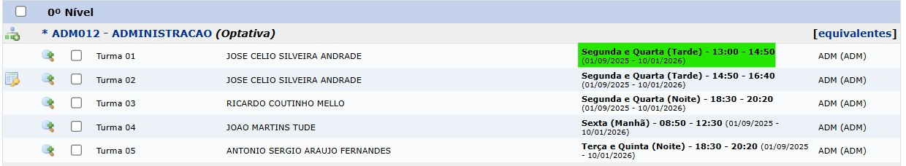
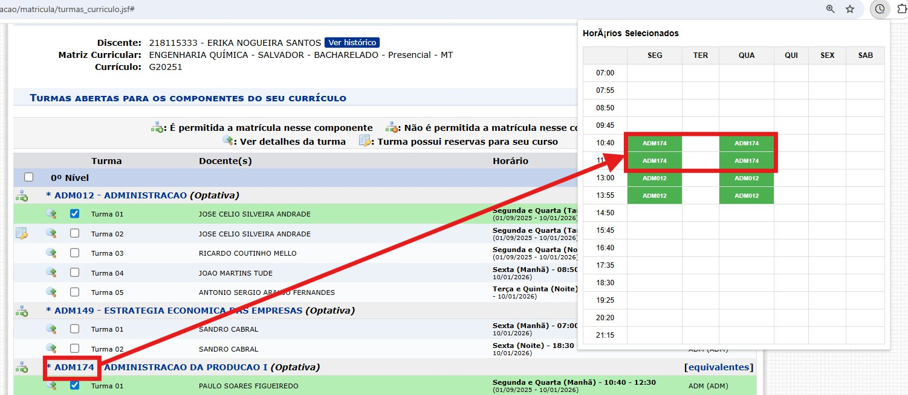

# Melhora Horários SIGAA UFBA

Uma extensão de navegador para facilitar a vida dos estudantes da UFBA, traduzindo os códigos de horário do SIGAA e exibindo uma grade visual das turmas selecionadas.

_Tradução automática dos horários na própria página de matrícula._

_Popup com a grade visual das turmas selecionadas, mostrando os códigos das matérias._

## ✨ Funcionalidades

- ✅ **Tradução Automática de Horários:** Chega de decifrar códigos! A extensão converte formatos complexos como `24T12` para um texto claro e legível: `Segunda e Quarta (Tarde) - 13:00 - 14:50`.
- 📅 **Grade de Horários Visual:** Conforme você seleciona as turmas na página de matrícula, a extensão monta sua grade de horários. Clique no ícone da extensão para abrir um popup e ver visualmente como sua semana ficará, ajudando a evitar conflitos de horário.

## 🚀 Instalação

Como a extensão ainda não está na Chrome Web Store, ela pode ser instalada manualmente em navegadores baseados no Chromium (Google Chrome, Brave, Edge, etc.).

1.  **Faça o download do projeto:**
    - Clique no botão verde "**<> Code**" no topo desta página e depois em "**Download ZIP**".
    - Descompacte o arquivo `.zip` em uma pasta no seu computador.

2.  **Instale a extensão no navegador:**
    - Abra seu navegador e acesse a página de extensões: `chrome://extensions`
    - Ative o **"Modo de desenvolvedor"** (geralmente um interruptor no canto superior direito).
    - Clique no botão **"Carregar sem compactação"** (Load unpacked).
    - Selecione a **pasta** para onde você descompactou os arquivos do projeto.
    - Pronto! O ícone da extensão deve aparecer na sua barra de ferramentas. (Talvez seja necessário fixá-lo clicando no ícone de quebra-cabeça 🧩).

## 💡 Como Usar

1.  Acesse a página de **Matrícula On-Line** no SIGAA da UFBA.
2.  A extensão irá traduzir os horários das turmas automaticamente.
3.  Marque os checkboxes das turmas que você tem interesse em cursar.
4.  Clique no ícone da extensão na barra de ferramentas para abrir o popup e ver sua grade de horários sendo montada em tempo real!

## 🤝 Contribuição

Contribuições são muito bem-vindas! Se você tem ideias para novas funcionalidades, melhorias ou encontrou algum problema, sinta-se à vontade para abrir uma **Issue** ou enviar um **Pull Request**.
